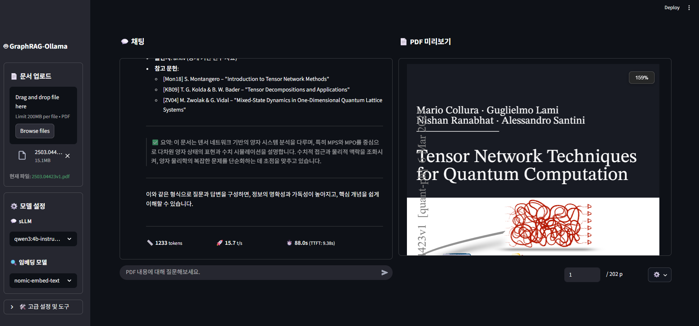

# GraphRAG-Ollama

> **A High-Performance, Local Retrieval-Augmented Generation (RAG) Solution with Modern UI.**  
> Optimized for extreme speed and precision using `LangGraph` orchestration, local `Ollama` models, and a sleek Streamlit interface.

[](https://www.python.org)
[](https://ollama.com/library/qwen3)
[]()
[](LICENSE)

---

## 📸 Preview



*GraphRAG-Ollama features a refined sidebar, real-time status logging, and a professional PDF viewer with a grouped-control navigation toolbar.*

---

## ⚡ Key Highlights

### 🚀 **Extreme Performance**
- **Optimized PyMuPDF4LLM:** Utilizes a specialized Markdown-native engine for ultra-fast document parsing (10x faster than traditional AI parsers) with font-size based noise reduction.
- **Ultra-Fast CPU Reranking:** Powered by `FlashRank` (ms-marco-MiniLM-L-12-v2), providing industrial-grade reranking performance directly on CPU.
- **Sub-Second TTFT:** Streamlined pipeline architecture minimizes Time To First Token, delivering answers almost instantly.
- **Semantic Chunking:** Advanced embedding-based chunking that respects document structure and context continuity.

### 🛡️ **Reliability & Integrity**
- **100% Integrity Pass:** Integrated verification system (`verify_integrity.py`) ensures code style, typing, and RAG logic are always production-ready.
- **LangGraph Orchestration:** Precise linear control over the retrieval-augmented generation flow.
- **Zero-Duplicate Streaming:** Professional-grade streaming protocol delivering both "AI Thinking" and "Final Answer" in real-time.

### 🎨 **Refined UI/UX**
- **Professional PDF Viewer:** Integrated viewer with precision navigation and grouped-control navigation.
- **Real-time Performance Metrics:** Visual tracking of TTFT, TPS, and input/output token counts for transparency.

---

## 🛠️ Tech Stack
<!-- TECH_STACK_START -->
- **Streamlit**: 1.50.0
- **LangChain**: 0.3.0
- **LangGraph**: 0.2.0
- **PyMuPDF4LLM**: 0.2.9
- **Ollama**: 0.2.2
- **FastAPI**: 0.128.0
<!-- TECH_STACK_END -->

---

## 🏗️ Project Structure
<!-- TREE_START -->
```text
rag-system-ollama/
├── src/
│   ├── api/
│   ├── cache/
│   ├── common/
│   ├── core/
│   ├── infra/
│   ├── logs/
│   ├── main.py # 🏁 Entry Point
│   ├── security/
│   ├── services/
│   └── ui/
├── scripts/
│   ├── analyze_logs.py
│   ├── archive/
│   ├── benchmarks/
│   ├── debug/
│   ├── evaluation/
│   ├── maintenance/
│   ├── quick_verify_rag.py
│   ├── test_full_pipeline.py
│   ├── verification/
│   └── verify_refactoring.py
├── tests/
│   ├── conftest.py
│   ├── data/
│   ├── integration/
│   ├── logs/
│   ├── performance/
│   ├── security/
│   └── unit/
```
<!-- TREE_END -->

---

## 🚀 Getting Started

### 1️⃣ Model Setup
```powershell
# Pull the recommended models
ollama pull qwen3:4b-instruct-2507-q4_K_M
ollama pull nomic-embed-text
```

### 2️⃣ Quick Integrity Check (Recommended)
Ensure your local environment is perfectly configured before running:
```powershell
python scripts/maintenance/verify_integrity.py
```

### 3️⃣ Running the App
```bash
streamlit run src/main.py
```

---

## 🧪 Testing & Verification

We maintain a strict **Zero-Error Policy**. Run the automated verification suite:
- **Lint & Static Analysis**: Ruff, Mypy
- **Core Integration**: RAG Pipeline, Retrieval Logic
- **UI & Streaming**: Streamlit Lifecycle, SSE Protocol
- **E2E**: Full PDF-to-Answer cycle

---

## 📄 License
MIT License - Developed by **darkzard05**.
**Status:** v3.1.0 | **Last Updated:** 2026-02-26
