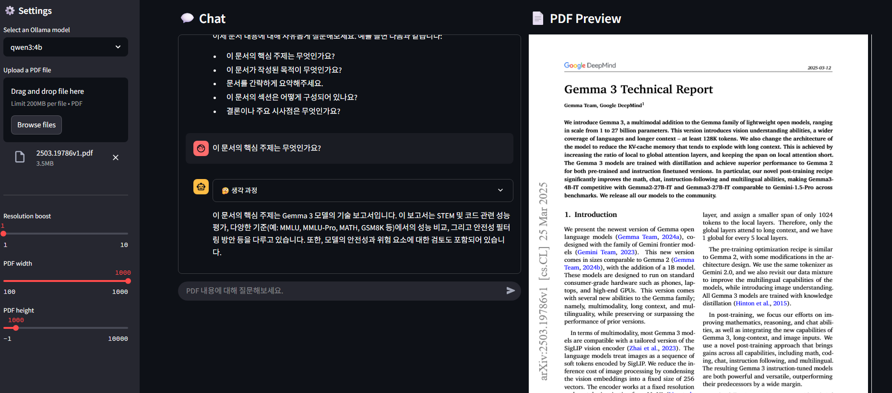

# RAG Chatbot with Ollama LLM  
**PDF-based Local Chatbot powered by Ollama and Streamlit**  
**PDF 기반 로컬 챗봇 (Ollama + Streamlit)**



## 🔑 Key Features / 주요 기능

- **PDF-based Q&A**  
  Upload a PDF and ask questions about its contents.  
  PDF를 업로드하고 해당 내용에 대해 질문할 수 있습니다.

- **Local LLM Processing with Ollama**  
  Your data stays private and is processed locally.  
  데이터를 외부 서버로 전송하지 않고 로컬에서 처리합니다.

- **Streamlit-based Web Interface**  
  Simple and intuitive UI to interact with the chatbot.  
  간편하고 직관적인 웹 인터페이스 제공.

---

## ⚡ Quick Start / 빠른 시작

### 📋 Prerequisites / 사전 준비 사항
- Python 3.10 or higher  
  Python 3.10 이상
- Ollama installed and running  
  Ollama 설치 및 실행 환경 구성

---

### 💻 Installation & Run / 설치 및 실행

1. **Clone the repository / 저장소 클론**
   ```bash
   git clone https://github.com/darkzard05/rag-system-ollama.git
   cd rag-system-ollama

2. 필요한 Python 패키지를 설치합니다:
   ```bash
   pip install -r requirements.txt
   ```

3. Ollama를 설치하고 실행합니다:
   - [Ollama 공식 웹사이트](https://ollama.com)에서 설치 파일을 다운로드하여 설치하세요.
   - 설치 후, `ollama list` 명령어를 실행하여 사용 가능한 모델을 확인합니다.

4. 추천 모델 다운로드:
   ```bash
   ollama pull qwen3:4b
   ```
   - `qwen3:4b` 모델은 이 애플리케이션에서 권장되는 모델입니다.

5. Streamlit 애플리케이션을 실행합니다:
   ```bash
   streamlit run src/main.py
   ```

6. 웹 브라우저에서 `http://localhost:8501`로 접속하여 애플리케이션을 사용합니다.

## 📁 Project Structure / 파일 구조
```
readme.md
requirements.txt
image/
    image1.png
    image2.png
    image3.png
src/
    main.py
    utils.py
```
- **readme.md**: Project description file / 프로젝트에 대한 설명 파일입니다.
- **requirements.txt**: List of required Python packages / 필요한 Python 패키지 목록입니다.
- **image/**: Folder containing project images / 프로젝트에서 사용하는 이미지 파일이 저장된 폴더입니다.
- **src/**: Folder containing main application source code / 애플리케이션의 주요 소스 코드가 포함된 폴더입니다.
  - **main.py**: Entry point of Streamlit application / Streamlit 애플리케이션의 진입점입니다.
  - **utils.py**: PDF processing and utility functions / PDF 처리 및 기타 유틸리티 함수가 포함된 파일입니다.

## 📝 How to Use / 사용 방법
1. Upload a PDF file in the sidebar / 사이드바에서 PDF 파일을 업로드합니다.
2. After the PDF is processed, enter your questions based on the document content / PDF 파일이 처리된 후, 문서 내용을 기반으로 질문을 입력합니다.
3. The chatbot will provide answers to your questions / 챗봇이 질문에 대한 답변을 제공합니다.

## 🤝 Contributing / 기여
Contributions are welcome! If you find a bug or want to suggest a new feature, please use the issue tracker in this repository.  
기여를 환영합니다! 버그를 발견하거나 새로운 기능을 제안하려면 이 저장소의 이슈 트래커를 사용하세요.

## 📄 License / 라이선스
This project is distributed under the MIT License. See the `LICENSE` file for more details.  
이 프로젝트는 MIT 라이선스 하에 배포됩니다. 자세한 내용은 `LICENSE` 파일을 참조하세요.
