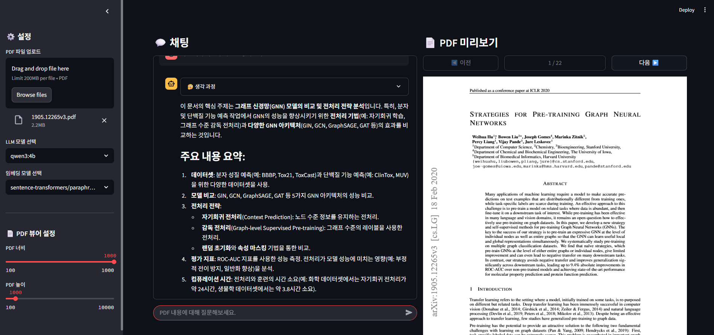

# RAG Chatbot with Ollama LLM  
**PDF-based Local Chatbot powered by Ollama and Streamlit**  
**PDF 기반 로컬 챗봇 (Ollama + Streamlit)**



## 🔑 Key Features / 주요 기능

- **PDF-based Q&A**  
  Upload your PDF documents and get answers to your questions based on their content.  
  PDF 문서를 업로드하고 해당 내용을 기반으로 질문에 대한 답변을 얻을 수 있습니다.

- **Local LLM Processing with Ollama**  
  Utilizes Ollama to run large language models locally, ensuring your data remains private and secure on your machine.  
  Ollama를 활용하여 로컬에서 대규모 언어 모델을 실행하므로 데이터가 사용자 기기 내에서 안전하게 비공개로 처리됩니다.

- **Streamlit-based Web Interface**  
  A user-friendly and interactive web interface built with Streamlit for easy document upload, chatting, and PDF viewing.  
  Streamlit으로 구축된 사용자 친화적이고 대화형 웹 인터페이스를 통해 손쉽게 문서를 업로드하고, 채팅하며, PDF를 확인할 수 있습니다.

- **View LLM's Thinking Process**
  Option to see the thought process of the LLM before it generates an answer, providing transparency.
  LLM이 답변을 생성하기 전의 사고 과정을 확인할 수 있는 옵션을 제공하여 투명성을 높입니다.

- **Customizable Experience**
  Adjust settings like the LLM model, text chunk size, and retrieval parameters through the UI.
  UI를 통해 LLM 모델, 텍스트 청크 크기, 검색 매개변수 등의 설정을 조정할 수 있습니다.

---

## ⚡ Quick Start / 빠른 시작

### 📋 Prerequisites / 사전 준비 사항
- **Python:** 3.10 or higher / Python 3.10 이상
- **Ollama:** Installed and the Ollama server must be running. / Ollama가 설치되어 있고 Ollama 서버가 실행 중이어야 합니다.
  - Refer to the [Ollama Official Website](https://ollama.com) for installation instructions. / 설치 안내는 [Ollama 공식 웹사이트](https://ollama.com)를 참조하세요.
- **System Resources:** Sufficient RAM (e.g., 8GB+ for smaller models like `qwen3:4b`, 16GB+ for larger models) is recommended for running Ollama and the models smoothly. / Ollama 및 모델을 원활하게 실행하려면 충분한 RAM(예: `qwen3:4b`와 같은 소형 모델의 경우 8GB 이상, 대형 모델의 경우 16GB 이상)이 권장됩니다.

---

### 💻 Installation & Run / 설치 및 실행

1. **Clone the repository / 저장소 클론**
   ```bash
   git clone https://github.com/darkzard05/rag-system-ollama.git
   cd rag-system-ollama

2. **(Recommended) Create and activate a virtual environment / (권장) 가상 환경 생성 및 활성화**
   ```bash
   python -m venv venv
   # Windows
   venv\Scripts\activate
   # macOS/Linux
   source venv/bin/activate
   ```

3. **Install required Python packages / 필요한 Python 패키지 설치**
   ```bash
   pip install -r requirements.txt
   ```

3. Ollama를 설치하고 실행합니다:
   - [Ollama 공식 웹사이트](https://ollama.com)에서 설치 파일을 다운로드하여 설치하세요.
   - 설치 후, `ollama list` 명령어를 실행하여 사용 가능한 모델을 확인합니다.

4. 추천 모델 다운로드:
   ```bash
   ollama pull qwen3:4b
   ```
   - `qwen3:4b` 모델은 이 애플리케이션에서 권장되는 모델입니다.

5. Streamlit 애플리케이션을 실행합니다:
   ```bash
   streamlit run src/main.py
   ```

6. 웹 브라우저에서 `http://localhost:8501`로 접속하여 애플리케이션을 사용합니다.

## 📁 Project Structure / 파일 구조
```
readme.md
requirements.txt
image/
    image1.png
    image2.png
    image3.png
src/
    main.py
    utils.py
```
- **readme.md**: Project description file / 프로젝트에 대한 설명 파일입니다.
- **requirements.txt**: List of required Python packages / 필요한 Python 패키지 목록입니다.
- **image/**: Folder containing project images / 프로젝트에서 사용하는 이미지 파일이 저장된 폴더입니다.
- **src/**: Folder containing main application source code / 애플리케이션의 주요 소스 코드가 포함된 폴더입니다.
  - **main.py**: Entry point of Streamlit application / Streamlit 애플리케이션의 진입점입니다.
    - Handles the user interface, chat logic, session state management, and orchestrates the RAG pipeline.
    - 사용자 인터페이스, 채팅 로직, 세션 상태 관리 및 RAG 파이프라인 조정을 담당합니다.
  - **utils.py**: PDF processing and utility functions / PDF 처리 및 기타 유틸리티 함수가 포함된 파일입니다.
    - Contains functions for loading and parsing PDF documents, splitting text into chunks, generating embeddings, managing the vector store (FAISS), and creating the QA chain with Ollama.
    - PDF 문서 로드 및 파싱, 텍스트 청크 분할, 임베딩 생성, 벡터 저장소(FAISS) 관리, Ollama를 사용한 QA 체인 생성 기능을 포함합니다.

## ✨ Key Components / 주요 구성 요소

- **PDF Loader (PyMuPDF):** Loads and extracts text content from uploaded PDF files. / 업로드된 PDF 파일에서 텍스트 내용을 로드하고 추출합니다.
- **Text Splitter (Langchain):** Divides the extracted text into smaller, manageable chunks for processing. / 추출된 텍스트를 처리하기 쉬운 작은 청크로 나눕니다.
- **Embedding Model (Sentence Transformers):** Converts text chunks into numerical vector embeddings. This project uses `sentence-transformers/paraphrase-multilingual-MiniLM-L12-v2` by default (supports multiple languages). / 텍스트 청크를 숫자 벡터 임베딩으로 변환합니다. 이 프로젝트는 기본적으로 `sentence-transformers/paraphrase-multilingual-MiniLM-L12-v2`를 사용합니다 (다국어 지원).
- **Vector Store (FAISS):** Stores these embeddings and allows for efficient similarity searches to find relevant chunks based on a user's query. / 이러한 임베딩을 저장하고 사용자 쿼리를 기반으로 관련 청크를 효율적으로 검색할 수 있도록 합니다.
- **Retriever:** Fetches the most relevant text chunks from the vector store based on the query. / 쿼리를 기반으로 벡터 저장소에서 가장 관련성이 높은 텍스트 청크를 가져옵니다.
- **Ollama LLM:** The selected local large language model (e.g., `qwen3:4b`) generates an answer using the user's query and the retrieved context. / 선택된 로컬 대규모 언어 모델(예: `qwen3:4b`)이 사용자 쿼리와 검색된 컨텍스트를 사용하여 답변을 생성합니다.
- **Streamlit UI:** Provides the interactive web interface for all user interactions. / 모든 사용자 상호 작용을 위한 대화형 웹 인터페이스를 제공합니다.

## 📝 How to Use / 사용 방법
1. Upload a PDF file in the sidebar / 사이드바에서 PDF 파일을 업로드합니다.
2. (Optional) Select your preferred Ollama model from the dropdown menu in the sidebar. / (선택 사항) 사이드바의 드롭다운 메뉴에서 선호하는 Ollama 모델을 선택합니다.
3. Wait for the PDF to be processed. A notification will appear. / PDF가 처리될 때까지 기다립니다. 알림이 표시됩니다.
4. Enter your questions about the document content in the chat input field. / 채팅 입력창에 문서 내용에 대한 질문을 입력합니다.
5. The chatbot will provide answers. You can expand the "🤔 생각 과정" (Thinking Process) section below each answer to see the LLM's reasoning steps. / 챗봇이 답변을 제공합니다. 각 답변 아래의 "🤔 생각 과정" 섹션을 확장하여 LLM의 추론 단계를 확인할 수 있습니다.

## ⚙️ Configuration / 설정

- **LLM Model:** Selectable via the UI from models downloaded in Ollama. Default is `qwen3:4b`. / Ollama에서 다운로드한 모델 중 UI를 통해 선택 가능. 기본값은 `qwen3:4b`입니다.
- **Embedding Model:** Currently set to `sentence-transformers/paraphrase-multilingual-MiniLM-L12-v2` (supports multiple languages) in `src/utils.py`. This constant can be changed in the code if a different embedding model is preferred. / 현재 `src/utils.py`에서 `sentence-transformers/paraphrase-multilingual-MiniLM-L12-v2`(다국어 지원)로 설정되어 있습니다. 다른 임베딩 모델을 선호하는 경우 코드에서 이 상수를 변경할 수 있습니다.

## 🛠️ Technical Stack / 기술 스택

- **Programming Language:** Python 3.10+
- **LLM Orchestration:** Langchain
- **Local LLM Server:** Ollama
- **Web Framework:** Streamlit
- **Embedding Models:** Sentence Transformers (Hugging Face)
- **PDF Processing:** PyMuPDF
- **Vector Store:** FAISS (Facebook AI Similarity Search)
- **Core ML/DL:** PyTorch

## 🚑 Troubleshooting / 문제 해결

- **Ollama Connection Issues / Ollama 연결 문제:**
  - Ensure the Ollama application/server is running. You can test this by running `ollama list` in your terminal. / Ollama 애플리케이션/서버가 실행 중인지 확인하세요. 터미널에서 `ollama list`를 실행하여 테스트할 수 있습니다.
  - If using Docker for Ollama, ensure the container is running and ports are correctly mapped. / Ollama에 Docker를 사용하는 경우 컨테이너가 실행 중이고 포트가 올바르게 매핑되었는지 확인하세요.
- **Model Not Found / 모델을 찾을 수 없음:**
  - Make sure you have pulled the desired model using `ollama pull <model_name>` (e.g., `ollama pull qwen3:4b`). / `ollama pull <model_name>` (예: `ollama pull qwen3:4b`)을 사용하여 원하는 모델을 다운로드했는지 확인하세요.
  - The model name selected in the UI must match a model available in your local Ollama instance. / UI에서 선택한 모델 이름이 로컬 Ollama 인스턴스에서 사용 가능한 모델과 일치해야 합니다.
- **Slow Performance / 느린 성능:**
  - Processing large PDFs or using very large/complex LLM models can be resource-intensive. / 대용량 PDF를 처리하거나 매우 크고 복잡한 LLM 모델을 사용하는 것은 리소스를 많이 소모할 수 있습니다.
  - Ensure your system meets Ollama's recommended specifications (especially RAM). / 시스템이 Ollama의 권장 사양(특히 RAM)을 충족하는지 확인하세요.
  - Consider using smaller/quantized LLM models available through Ollama. / Ollama를 통해 사용 가능한 더 작거나 양자화된 LLM 모델 사용을 고려해 보세요.
  - Adjusting chunk size/overlap or reducing the 'K' value for retrieval might help for very large documents. / 매우 큰 문서의 경우 청크 크기/중복을 조정하거나 검색을 위한 'K' 값을 줄이는 것이 도움이 될 수 있습니다.
- **`torch.classes.__path__ = []` in `main.py`:**
  - This line is a workaround for a known issue with certain PyTorch and TorchVision versions. If you encounter import errors related to `torchvision.models`, this line might be the cause or solution depending on your environment.
  - 이 라인은 특정 PyTorch 및 TorchVision 버전의 알려진 문제에 대한 해결 방법입니다. `torchvision.models`와 관련된 가져오기 오류가 발생하는 경우, 환경에 따라 이 라인이 원인이거나 해결책이 될 수 있습니다.

## 🤝 Contributing / 기여
Contributions are welcome! If you find a bug or want to suggest a new feature, please use the issue tracker in this repository.  
기여를 환영합니다! 버그를 발견하거나 새로운 기능을 제안하려면 이 저장소의 이슈 트래커를 사용하세요.

## 📄 License / 라이선스
This project is distributed under the MIT License. See the `LICENSE` file for more details.  
이 프로젝트는 MIT 라이선스 하에 배포됩니다. 자세한 내용은 `LICENSE` 파일을 참조하세요.
