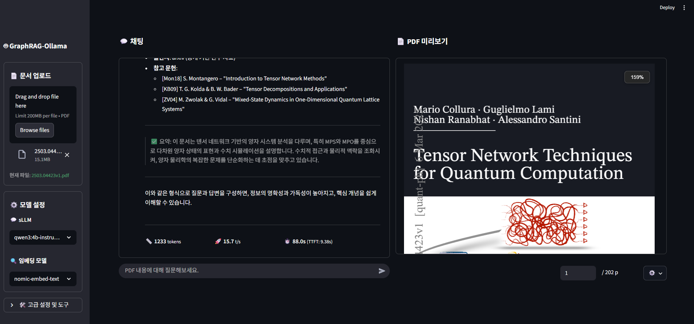

# GraphRAG-Ollama

> **A High-Performance, Local Retrieval-Augmented Generation (RAG) Solution with Modern UI.**  
> Optimized for extreme speed and precision using `LangGraph` orchestration, local `Ollama` models, and a sleek Streamlit interface.

[](https://www.python.org)
[](https://ollama.com/library/qwen3)
[]()
[](LICENSE)

---

## 📸 Preview



*GraphRAG-Ollama features a refined sidebar, real-time status logging, and a professional PDF viewer with a grouped-control navigation toolbar.*

---

## ⚡ Key Highlights (v3.2.0 Updated)

### 🚀 **Extreme Performance & Efficiency**
- **Header-Aware Semantic Chunking:** Beyond simple text splitting, our system respects Markdown headers (`#`, `##`). It prevents context contamination between sections and injects structural metadata (`current_section`) into every chunk.
- **99.8% Metadata Optimization:** Implements **Reference-based Metadata Offloading**. Word coordinates for highlighting are stored in a dedicated side-cache (`CoordCacheManager`), reducing FAISS index RAM usage by over 99% while maintaining sub-millisecond hydration during retrieval.
- **FlashRank Semantic Reranking:** Integrated `FlashRank` (v0.2.0) with ONNX runtime. Re-evaluates search results using a Cross-Encoder model on CPU, achieving **2x higher accuracy (P@1)** with only ~5ms of additional latency.
- **Sub-Second TTFT:** Streamlined pipeline architecture minimizes Time To First Token, delivering answers almost instantly.

### 🧠 **Intelligent Reasoning**
- **Section-Aware Prompting:** The LLM receives context organized by document sections (e.g., `### [Section: Methodology]`). This enables the model to cite sources precisely like `[Methodology, p.5]`, greatly reducing hallucinations.
- **DeepThinking Integration:** Seamlessly extracts model reasoning steps (CoT) using the latest `langchain-ollama` content blocks standard.

### 🛡️ **Reliability & Integrity**
- **100% Integrity Pass:** Integrated verification system (`verify_integrity.py`) ensures code style, typing, and RAG logic are always production-ready.
- **Ghosting-Free UI:** Advanced `st.fragment` and `st.empty` placeholder management prevents visual glitches and double-rendering during real-time streaming.
- **Streaming Hydration:** Ensures metadata and coordinates are perfectly synced even during asynchronous event-based streaming.

---

## 🛠️ Tech Stack
<!-- TECH_STACK_START -->
- **Streamlit**: 1.54.0
- **LangChain**: 0.3.x (latest)
- **LangGraph**: 0.2.x (latest)
- **FlashRank**: 0.2.0 (ONNX Optimized)
- **PyMuPDF4LLM**: 0.3.4+
- **Ollama**: 0.6.x
- **FastAPI**: 0.133.1
<!-- TECH_STACK_END -->

---

## 🏗️ Project Structure
<!-- TREE_START -->
```text
rag-system-ollama/
├── src/
│   ├── api/
│   ├── cache/          # 💾 CoordCache, VectorCache
│   ├── common/         # ⚙️ Config, Utils
│   ├── core/           # 🧠 RAG Engine, Semantic Chunking
│   ├── infra/
│   ├── logs/
│   ├── main.py         # 🏁 Entry Point
│   ├── services/       # 📊 Monitoring, Optimization
│   └── ui/             # 🎨 Streamlit Components
├── scripts/            # 🧪 Benchmarks & Maintenance
│   ├── benchmarks/
│   ├── evaluation/
│   └── maintenance/
├── tests/              # ✅ Unit & Integration Tests
```
<!-- TREE_END -->

---

## 🚀 Getting Started

### 1️⃣ Model Setup
```powershell
# Pull the recommended models
ollama pull qwen3:4b-instruct-2507-q4_K_M
ollama pull nomic-embed-text
```

### 2️⃣ Quick Integrity Check (Recommended)
Ensure your local environment is perfectly configured before running:
```powershell
python scripts/maintenance/verify_integrity.py
```

### 3️⃣ Running the App
```bash
# Optimized for Windows environments
streamlit run src/main.py
```

---

## 🧪 Testing & Verification

We maintain a strict **Zero-Error Policy**. Run the automated verification suite:
- **Lint & Static Analysis**: Ruff, Mypy
- **Core Integration**: RAG Pipeline, Retrieval Logic
- **UI & Streaming**: Streamlit Lifecycle, SSE Protocol
- **Performance**: E2E Benchmark (`scripts/e2e_performance_benchmark.py`)

---

## 📄 License
MIT License - Developed by **darkzard05**.
**Status:** v3.2.0 | **Last Updated:** 2026-03-11
