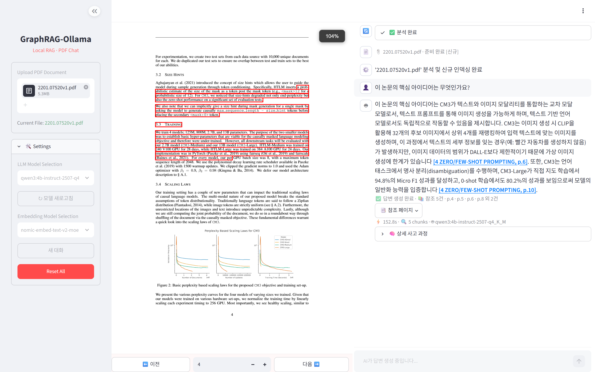

# GraphRAG-Ollama

> **A High-Performance, Local Retrieval-Augmented Generation (RAG) Solution with Modern UI.**  
> Optimized for extreme speed and precision using `LangGraph` orchestration, local `Ollama` models, and a sleek Streamlit interface.

[](https://www.python.org)
[](https://ollama.com/library/qwen3)
[]()
[](LICENSE)

---

## 📸 Preview



*GraphRAG-Ollama features a refined sidebar, real-time status logging, and a professional PDF viewer with a grouped-control navigation toolbar.*

---

## ⚡ Key Highlights (v3.3.0 Updated)

### 🚀 **Extreme Performance & Efficiency**
- **Header-Aware Semantic Chunking:** Beyond simple text splitting, our system respects Markdown headers (`#`, `##`). It prevents context contamination between sections and injects structural metadata (`current_section`) into every chunk.
- **99.8% Metadata Optimization:** Implements **Reference-based Metadata Offloading**. Word coordinates for highlighting are stored in a dedicated side-cache (`CoordCacheManager`), reducing FAISS index RAM usage by over 99% while maintaining sub-millisecond hydration during retrieval.
- **FlashRank Semantic Reranking:** Integrated `FlashRank` (v0.2.0) with ONNX runtime. Re-evaluates search results using a Cross-Encoder model on CPU, achieving **2x higher accuracy (P@1)** with minimal latency.

### 🧠 **Intelligent Reasoning & Citations**
- **Configurable Prompt System:** All RAG prompts (`grading`, `rewriting`, `QA`) are externalized in `config.yml`. They use generalized instructions to handle complex model names and technical terms without hardcoding.
- **Section-Aware Citations:** Implements an advanced citation processor that extracts section names and matches them with document metadata. Provides **Interactive Citation Badges** with sub-second preview tooltips.
- **Relevant Entity Extraction:** The LLM is strictly instructed to extract key technical entities during the grading phase, ensuring transparency in its reasoning process.

### 🛡️ **Reliability & Integrity**
- **Multi-Layer Unit Testing:** 13+ new unit tests covering Graph Flow, RAG Orchestration, Document Processing, and Advanced Citations.
- **100% Integrity Pass:** Integrated verification system (`verify_integrity.py`) ensures code style, typing, and RAG logic are always production-ready.
- **Ghosting-Free UI:** Advanced `st.fragment` and `st.empty` placeholder management prevents visual glitches during real-time streaming.

---

## 🛠️ Tech Stack
<!-- TECH_STACK_START -->
- **Streamlit**: 1.54.0
- **LangChain**: 0.3.18
- **LangGraph**: 0.2.74
- **PyMuPDF4LLM**: latest
- **Ollama**: 0.6.1
- **FastAPI**: 0.133.1
<!-- TECH_STACK_END -->

---

## 🏗️ Project Structure
<!-- TREE_START -->
```text
rag-system-ollama/
├── src/
│   ├── .deepeval/
│   ├── api/
│   ├── cache/
│   ├── common/
│   ├── core/
│   ├── data/
│   ├── infra/
│   ├── main.py # 🏁 Entry Point
│   ├── security/
│   ├── services/
│   └── ui/
├── scripts/
│   ├── .model_cache/
│   ├── analyze_dom.py
│   ├── analyze_logs.py
│   ├── analyze_paths.py
│   ├── bench_ui_render.py
│   ├── bench_ui_render_v2.py
│   ├── benchmarks/
│   ├── check_css_presence.py
│   ├── compare_chunking_logic.py
│   ├── container_dom_test.py
│   ├── debug_layout.py
│   ├── deep_dom_analysis.py
│   ├── diagnose_input.py
│   ├── diagnose_ui.py
│   ├── discover_selectors.py
│   ├── dump_dom.py
│   ├── dump_page.py
│   ├── e2e_performance_benchmark.py
│   ├── eval_grader.py
│   ├── eval_results.json
│   ├── eval_retrieval.py
│   ├── evaluate_pipeline.py
│   ├── evaluation/
│   ├── explore_dom.py
│   ├── find_containers.py
│   ├── inspect_containers.py
│   ├── kill_streamlit.py
│   ├── maintenance/
│   ├── quick_verify_rag.py
│   ├── README.md
│   ├── reverify_dom_task1.py
│   ├── simple_eval.py
│   ├── standardize_imports.py
│   ├── test_app.py
│   ├── test_embedding_v2.py
│   ├── test_full_pipeline.py
│   ├── test_highlight_query_cleaning.py
│   ├── test_pipeline_direct.py
│   ├── test_rag_eval.py
│   ├── test_real_pdf_chunking.py
│   ├── test_self_correction.py
│   ├── validate_config.py
│   ├── verification/
│   ├── verify_css_override.py
│   ├── verify_dom_structure.py
│   ├── verify_e2e_all.py
│   ├── verify_final.py
│   ├── verify_fixes.py
│   ├── verify_height_fill.py
│   ├── verify_layout_height_fill.py
│   ├── verify_layout_scroll_fix.py
│   ├── verify_metadata_opt.py
│   ├── verify_new_layout.py
│   ├── verify_phase2.py
│   ├── verify_section_metadata.py
│   ├── verify_styles.py
│   ├── verify_ui_scrolling.py
│   └── visual_qa_automation.py
├── tests/
│   ├── conftest.py
│   ├── data/
│   ├── e2e/
│   ├── integration/
│   ├── README.md
│   ├── security/
│   ├── smoke_test.py
│   ├── stability/
│   ├── test_loop_independence.py
│   ├── test_p0_1_pdf_handle_leak.py
│   ├── test_ui_bridge.py
│   ├── unit/
│   └── utils/
```
<!-- TREE_END -->

---

## 🚀 Getting Started

### 1️⃣ Model Setup
```powershell
# Pull the recommended models
ollama pull qwen3:4b-instruct-2507-q4_K_M
ollama pull nomic-embed-text
```

### 2️⃣ Configuration
Customize your RAG behavior in `config.yml` (e.g., grading instructions, chunk sizes, model names).

### 3️⃣ Running the App
```bash
# Optimized for Windows environments
streamlit run src/main.py
```

---

## 🔐 Authentication & API

The API server bootstraps an admin account: set `TEST_ADMIN_PASSWORD` (else a random password is printed to stderr once). All API routes require a Bearer token (JWT via `/api/v1/login` or an API key). Revocation persists via `AUTH_STATE_FILE`; tokens survive restarts. API uploads are stored in `data/temp/pdf_library` and served at `/api/v1/pdf/{hash}`.

---

## 🧪 Testing & Verification

We maintain a strict **Zero-Error Policy**. Run the automated verification suite:
```powershell
# Run all unit tests
pytest tests/unit

# Run full pipeline integration test
python scripts/test_full_pipeline.py

# Verify section metadata extraction
python scripts/verify_section_metadata.py
```

CI enforces unit coverage ≥55% (`--cov-fail-under=55`) and additionally runs the auth/ownership/PDF/SSE integration tests (`test_api_auth_login`, `test_api_pdf_serving`, `test_global_exception_handler`, `test_ownership_hardening`, `test_pdf_library_retention`, `test_stream_error_isolation`, `test_api_endpoints`).

---

## 📄 License
MIT License - Developed by **darkzard05**.
**Status:** v3.3.0 | **Last Updated:** 2026-03-12
