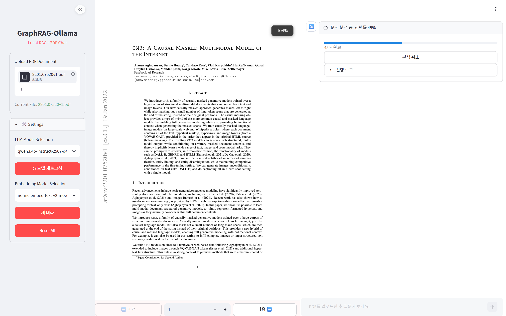
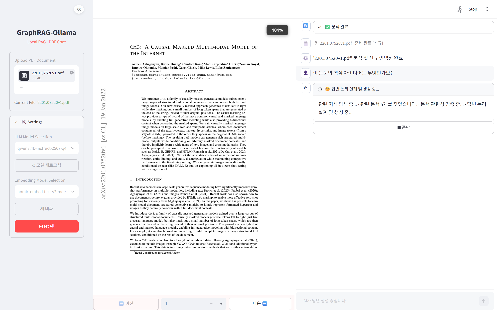

# GraphRAG-Ollama

> **A High-Performance, Local Retrieval-Augmented Generation (RAG) Solution with Modern UI.**  
> Optimized for extreme speed and precision using `LangGraph` orchestration, local `Ollama` models, and a sleek Streamlit interface.

[](https://www.python.org)
[](https://ollama.com/library/qwen3)
[]()
[](LICENSE)

---

## 📸 Preview


*GraphRAG-Ollama features a refined sidebar, real-time status logging, and a professional PDF viewer with a grouped-control navigation toolbar. The unified chat timeline surfaces every pipeline stage — document indexing, retrieval, streaming generation, and the final cited answer with page-level references.*

### Pipeline in action





---

## ⚡ Key Highlights (2026-08 Updated)

### 🚀 **Extreme Performance & Efficiency**
- **Header-Aware Semantic Chunking:** Beyond simple text splitting, our system respects Markdown headers (`#`, `##`). It prevents context contamination between sections and injects structural metadata (`current_section`) into every chunk.
- **99.8% Metadata Optimization:** Implements **Reference-based Metadata Offloading**. Word coordinates for highlighting are stored in a dedicated side-cache (`CoordCacheManager`), reducing FAISS index RAM usage by over 99% while maintaining sub-millisecond hydration during retrieval.
- **FlashRank Semantic Reranking:** Integrated `FlashRank` (v0.2.0) with ONNX runtime. The cross-encoder re-evaluates search results on CPU and cleanly separates relevant documents (score ≥ `min_score_to_skip`, default 0.85) from out-of-scope ones, enabling the fast-path grade short-circuit (`rag.reranker.engine`: `auto` / `flashrank` / `semantic`).

### 🧠 **Intelligent Reasoning & Citations**
- **Configurable Prompt System:** All RAG prompts (`grading`, `rewriting`, `QA`) are externalized in `config.yml`. They use generalized instructions to handle complex model names and technical terms without hardcoding.
- **Section-Aware Citations:** Implements an advanced citation processor that extracts section names and matches them with document metadata. Provides **Interactive Citation Badges** with sub-second preview tooltips.
- **Relevant Entity Extraction:** The LLM is strictly instructed to extract key technical entities during the grading phase, ensuring transparency in its reasoning process.

### 🛡️ **Reliability & Integrity**
- **68+ unit test files** covering Graph Flow, RAG Orchestration, Document Processing, Advanced Citations, concurrency, and streaming.
- **CI-enforced integrity:** `ruff check`, `ruff format --check`, `mypy src`, `bandit`, `pip-audit`, unit coverage ≥55%, and 12 integration tests (auth/ownership/PDF/SSE).
- **Ghosting-Free UI:** Advanced `st.fragment` and `st.empty` placeholder management prevents visual glitches during real-time streaming.
- **Robust PDF handling:** Corrupt PDFs are rejected upfront on upload; the viewer stays crash-proof and layout-preserved.

### 🆕 Recent Improvements (2026-06 → 08)
- **Reasoning extraction:** `models.thinking` (default `true`) enables Ollama native reasoning streams, surfaced in the UI as a native "reasoning expander" with a condensed pipeline summary per answer.
- **Faster first query:** embedding model, FlashRank ONNX, and the default LLM are preloaded at build time (silently skipped on failure); `num_ctx` raised to 8192.
- **GPU batch embedding:** the Ollama embedder now picks batch size from available VRAM (`embedding_batch_size: auto`), cutting embedding HTTP round-trips.
- **Non-blocking cache I/O:** DiskCache operations run on a worker thread (`asyncio.to_thread`) with an incremental size counter and an optional `persist_to_disk=False` fast path.
- **Streamlit 1.60:** upgrade fixes a pdf-viewer scroll regression; hash-based PDF serving (`/api/v1/pdf/{hash}`) is path-injection-safe with multi-page highlight coordinates.
- **Eval harness:** `scripts/eval_quality.py` measures P@1/MRR@5/TTFT/tokens-per-sec + LLM judge score per run into `reports/`.

---

## 🛠️ Tech Stack
<!-- TECH_STACK_START -->
- **Streamlit**: 1.60.0
- **LangChain**: 0.3.18
- **LangGraph**: 0.2.74
- **PyMuPDF4LLM**: latest
- **Ollama**: 0.6.1
- **FastAPI**: 0.133.1
<!-- TECH_STACK_END -->

---

## 🏗️ Project Structure
<!-- TREE_START -->
```text
rag-system-ollama/
├── src/
│   ├── api/
│   ├── cache/
│   ├── common/
│   ├── core/
│   │   └── session/
│   ├── infra/
│   ├── main.py # 🏁 Entry Point
│   ├── security/
│   ├── services/
│   │   ├── monitoring/
│   │   └── optimization/
│   └── ui/
│       ├── components/
│       └── styles/
├── scripts/
│   ├── analyze_dom.py
│   ├── analyze_logs.py
│   ├── analyze_paths.py
│   ├── bench_ui_render.py
│   ├── bench_ui_render_v2.py
│   ├── benchmarks/
│   ├── check_css_presence.py
│   ├── compare_chunking_logic.py
│   ├── container_dom_test.py
│   ├── debug_layout.py
│   ├── deep_dom_analysis.py
│   ├── diagnose_input.py
│   ├── diagnose_ui.py
│   ├── discover_selectors.py
│   ├── dump_dom.py
│   ├── dump_page.py
│   ├── e2e_performance_benchmark.py
│   ├── eval_grader.py
│   ├── eval_quality.py
│   ├── eval_results.json
│   ├── eval_retrieval.py
│   ├── evaluate_pipeline.py
│   ├── evaluation/
│   ├── explore_dom.py
│   ├── find_containers.py
│   ├── inspect_containers.py
│   ├── kill_streamlit.py
│   ├── layout_probe.py
│   ├── maintenance/
│   ├── probe_qwen3_thinking.py
│   ├── quick_verify_rag.py
│   ├── README.md
│   ├── reverify_dom_task1.py
│   ├── simple_eval.py
│   ├── standardize_imports.py
│   ├── test_app.py
│   ├── test_embedding_v2.py
│   ├── test_full_pipeline.py
│   ├── test_highlight_query_cleaning.py
│   ├── test_pipeline_direct.py
│   ├── test_rag_eval.py
│   ├── test_real_pdf_chunking.py
│   ├── test_self_correction.py
│   ├── validate_config.py
│   ├── verification/
│   ├── verify_css_override.py
│   ├── verify_dom_structure.py
│   ├── verify_e2e_all.py
│   ├── verify_final.py
│   ├── verify_fixes.py
│   ├── verify_height_fill.py
│   ├── verify_layout_height_fill.py
│   ├── verify_layout_scroll_fix.py
│   ├── verify_metadata_opt.py
│   ├── verify_new_layout.py
│   ├── verify_phase2.py
│   ├── verify_section_metadata.py
│   ├── verify_styles.py
│   ├── verify_ui_scrolling.py
│   └── visual_qa_automation.py
├── tests/
│   ├── conftest.py
│   ├── e2e/
│   ├── integration/
│   ├── README.md
│   ├── security/
│   ├── smoke_test.py
│   ├── stability/
│   ├── test_loop_independence.py
│   ├── test_p0_1_pdf_handle_leak.py
│   ├── test_ui_bridge.py
│   ├── unit/
│   └── utils/
```
<!-- TREE_END -->

---

## 🚀 Getting Started

### 1️⃣ Model Setup
```powershell
# Pull the recommended models
ollama pull qwen3:4b-instruct-2507-q4_K_M
ollama pull nomic-embed-text-v2-moe  # default embedding model (config.yml: models.default_embedding)
# Optional (legacy embedding model):
ollama pull nomic-embed-text
```

### 2️⃣ Configuration
Customize your RAG behavior in `config.yml` (e.g., grading instructions, chunk sizes, model names).

### 3️⃣ Running the App
```bash
# Optimized for Windows environments
streamlit run src/main.py
```

---

## 🔐 Authentication & API

The API server bootstraps an admin account: set `TEST_ADMIN_PASSWORD` (else a random password is printed to stderr once). All API routes require a Bearer token (JWT via `/api/v1/login` or an API key). Revocation persists via `AUTH_STATE_FILE`; tokens survive restarts. API uploads are stored in `data/temp/pdf_library` and served at `/api/v1/pdf/{hash}`.

---

## 🧪 Testing & Verification

We maintain a strict **Zero-Error Policy**. Run the automated verification suite:
```powershell
# Run all unit tests
pytest tests/unit

# Full pipeline integration test
python scripts/test_full_pipeline.py

# Verify section metadata extraction
python scripts/verify_section_metadata.py

# Integrity check (style, typing, RAG logic)
python scripts/maintenance/verify_integrity.py
```

CI enforces unit coverage ≥55% (`--cov-fail-under=55`) and additionally runs `bandit`, `pip-audit`, and the integration tests: `test_rag_integration`, `test_streamlit_app`, `test_streaming_response`, `test_cache_security`, `test_caching_system`, `test_api_auth_login`, `test_api_pdf_serving`, `test_global_exception_handler`, `test_ownership_hardening`, `test_pdf_library_retention`, `test_stream_error_isolation`, `test_api_endpoints`.

---

## 🎯 Answer Quality & Evaluation

Evaluate retrieval and answer quality end to end with the built-in harness:

```bash
# Full run: retrieval + generation + judge scoring
python scripts/eval_quality.py --tag <tag> --testset_n 3

# Retrieval-only: skip the LLM judge for faster iteration
python scripts/eval_quality.py --tag <tag> --no-llm
```

Each run writes `reports/eval_quality_<tag>_<ts>.json` and `.md` with per-question metrics (P@1, MRR@5, TTFT, tokens/sec) plus an average judge score.

**Reranking.** The reranker engine is selected in `config.yml` → `rag.reranker.engine`: `auto` (tries the FlashRank cross-encoder, falls back to the bi-encoder `semantic` reranker on failure), `flashrank` (forced), or `semantic` (bi-encoder). When a pipeline is built, the default LLM is preloaded automatically (silently skipped if loading fails).

**Key settings:**

| Key | Default | Purpose |
|-----|---------|---------|
| `models.ollama_num_predict` | 2048 | Max generated tokens per answer |
| `models.num_ctx` | 8192 | Model context window (tokens) |
| `models.thinking` | true | Enable Ollama native reasoning extraction |
| `models.embedding_batch_size` | auto | Embedding batch size (auto = GPU VRAM-based) |
| `rag.parsing.hydration_mode` | precision_clip | PDF coordinate extraction mode for highlighting |
| `rag.reranker.engine` | auto | Reranker engine: `auto` / `flashrank` / `semantic` |
| `rag.prompts.grading.min_score_to_skip` | 0.85 | Skip the LLM grade when the max rerank score reaches this |
| `global_cache.enable_vector_cache` | true | Enable vector store (indexing results) caching |
| `ui.timeline_poll_seconds` | 1.0 | Timeline fragment auto-refresh interval (seconds) |

---

## 📄 License
MIT License - Developed by **darkzard05**.
**Last Updated:** 2026-08-09
